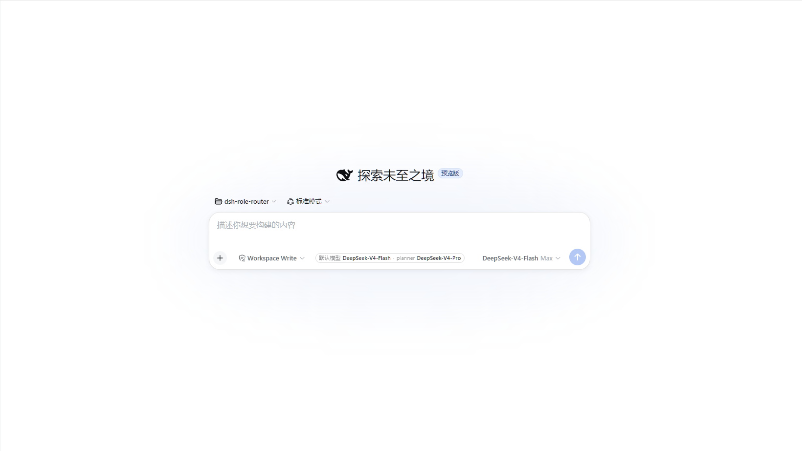
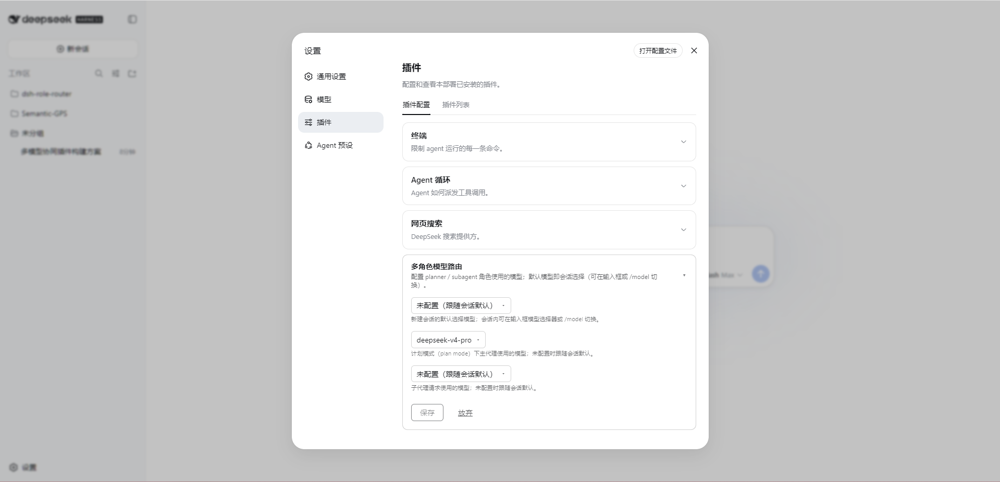

中文 | [English](README.en.md)

# 多角色模型路由插件（dsh-role-router）

还在为计划与执行阶段手动切换模型而烦恼？`dsh-role-router` 替你自动完成：输入 `/plan` 进入计划模式，请求即自动路由到配置的 planner 模型；退出计划模式自动切回默认模型——全程无需手动干预。

- **角色路由**：`default` / `planner` / `subagent` 三种角色独立配置，未配置的角色放行（跟随会话默认）；`planner` 由计划模式（`/plan` 等）自动触发，`default` 始终跟随官方会话级模型选择。
- **Web UI**：设置页「多角色模型路由」卡片提供三个模型下拉框，选项与 `/model` 同源（host 实时模型目录，provider 分组，自动刷新）；composer 旁附模型摘要胶囊，当前选择一目了然。
- **两级配置**：支持 cordis.yml（composition 层）与 `role-router` settings 命名空间（用户层，后者优先）；保存即生效，无需重启。

## 预览





## 路由语义

每次模型请求按角色路由，监听器注册在根上下文（同时覆盖主代理与所有进程内子代理）：

| 角色 | 请求范围 | 模型来源 |
|---|---|---|
| `default` | 默认模式下的主代理请求 | **官方会话级模型选择**（composer 模型席位 / `/model` / agent-default-model 设置）。请求**原样放行**，不做任何改写——官方下拉切到什么模型，默认模式就用什么模型 |
| `planner` | 计划模式（plan mode）下的主代理请求 | 插件配置（设置卡片 → `role-router` 设置命名空间，或 cordis.yml 的 `planner` 项）；未配置时放行（跟随会话默认） |
| `subagent` | 所有进程内子代理请求（任意嵌套深度） | 插件配置（`subagent` 项）；未配置时放行 |

切换模型时**剥离**继承的 adapter-owned `reasoningEffort`（目标模型可能不支持原模型的推理档位；`prepareCall` 会拒绝未受支持的显式 effort）。`default` 角色从不改写，因此其 effort 恒保留。

计划模式状态从会话日志的 `plan/mode` 事件折叠（`foldPlanMode`）；`ctx.planMode` 可见时优先读取（含 pending 意图）。

辅助模型调用（compaction、session-title）不经 `agent/request` 派发，不受影响；进程外子代理 provider（acp、codex 等）的请求不经过本进程，同样不受影响。

## Web UI（client 半区）

插件声明了 `dsh.client`（platform: web），向 Web GUI 提供两处界面：

1. **设置 → 插件配置 →「多角色模型路由」卡片**：三个模型下拉框（默认模型 / planner / subagent），选项来自 host 实时模型目录（provider 分组，与 `/model` 同源，`llm/adapters-updated` 自动刷新）。
   - `默认模型` 字段直接编辑官方 `agent-default-model` 设置（字段级写入，`reasoningEffort` 不受影响）——配置的默认模型就是**新建会话的默认选择**。
   - `planner` / `subagent` 字段写入 `role-router` 设置命名空间，保存后下一请求即生效（无需重启）。
2. **会话输入框旁（composer）**：胶囊摘要显示 `默认模型: <当前会话选择> · planner: <配置的 planner 模型>`。官方模型席位（下拉选择）与 `/model` 命令保持原样。

## 配置

### cordis.yml（composition 层）

```yaml
- id: model-router
  name: '@SnowAmberX/dsh-role-router'
  config:
    default:        # 必填；仅作为 settings 服务缺失时的兜底
      provider: deepseek-official
      model: deepseek-v4-flash
    planner:        # 可选
      provider: deepseek-official
      model: deepseek-v4-pro
    subagent:       # 可选
      provider: deepseek-official
      model: deepseek-v4-flash
```

未知键、空白 provider/model 在加载期直接报错（fail loud）。`default` 必填（schema 兼容），但运行时 `default` 角色的实际值来自官方 agent-default-model 选择。

### settings（用户层）

`role-router` 命名空间：`{ planner?: { provider, model }, subagent?: { provider, model } }`。设置文档值优先于 composition 层。

## 安装

```bash
dsh plugin --profile web add @SnowAmberX/dsh-role-router
# 本地开发：
dsh plugin --profile web add link:/path/to/this/repo
```

重启 `dsh web` 后生效（client-modules 的包元数据在重启时重新扫描）。

## 开发

```bash
pnpm install        # @deepseek-ai/* 运行时依赖由 harness checkout 软链提供（见下）
pnpm build          # tsc（host 半区 + 类型）+ tsdown（client bundle）
pnpm test           # vitest（host 路由集成测试 + 配置/分类单测）
```

`@deepseek-ai/*` 及 react/tsdown/lightningcss 等依赖通过 `node_modules` 软链指向 DeepSeek Harness checkout（与官方 profile 的 flat-fallback 机制一致），无需 npm 安装；tsconfig 开启 `preserveSymlinks` 使类型解析走同一平铺链。

## 已知限制

- 模型目录是 advisory（adapter 可接受未列出的模型 id），下拉框只列出目录内模型。
- composer 摘要仅显示 `default` + `planner` 两个角色（`subagent` 不在摘要范围）。
- 设置页无当前会话时，卡片下拉框显示"打开会话后可加载模型列表"（目录经当前会话的 `session.models` RPC 获取，groups 本身是全局的）。
- `planner`/`subagent` 配置的 provider 未注册 adapter 时，请求按 harness 常规路径报 NO_ADAPTER 轮次错误（响亮失败，不静默降级）。
